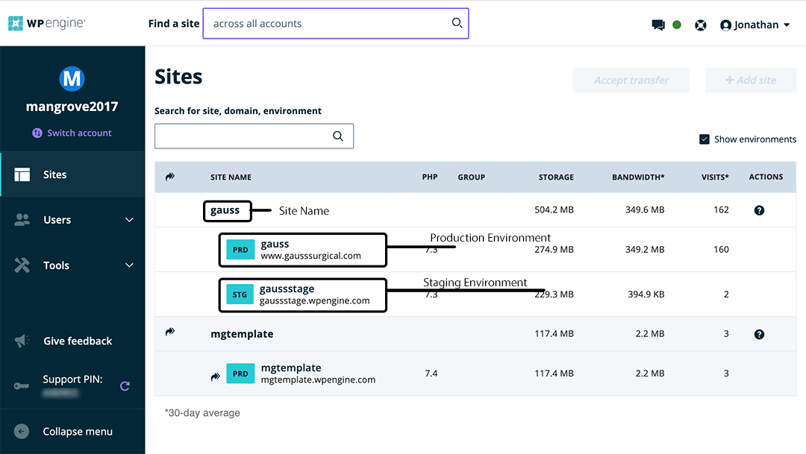

# Access
{:toc}

## SSH Public Key
Add your SSH public key, **not the private key**, to the [SSH Keys document](https://docs.google.com/document/d/18f2wRxvz3h4fRB6XDwiAOWtG9yAR9olstZruN3ppMRY), and let your Mangrove contact know it's there so they can [add it to WPEngine](wpe-add-git-key).

If you don't yet have a public key, see the documentation on [generating an SSH key](generate-ssh-key).

## Mangrove Accounts
You should have a `yourname@mangrove-web.com` GSuite (Gmail) account. With this, setup accounts on these services:
* LastPass - shared password management
* Asana - project management
* Harvest - time tracking/billing
* Slack - chat
* WPEngine - WordPress host
* [WIP] Toybox?

## LastPass
We recommend you manage all your Mangrove passwords using LastPass. Create a "My Accounts" folder for your own logins.

You will be granted access to the `Shared-Mangrove Team Internal (Limited) - for new devs` shared folder.

## WPEngine
Log in to [my.wpengine.com](https://my.wpengine.com/). A Mangrove administrator should already have given you access the sites for you to work on. Sites are listed under various accounts, so if you don't see it at your my.wpengine.com home screen, you may need to use the "switch account" link.

### Environments
On WPEngine, each site has one or more environments. Each of these is a complete WordPress install with a separate database and files. The production environment (PRD) hosts the live website, while the other environment(s) is(/are) used for development.

### Legacy Staging
Before the current environments system, WPEngine had a "1-Click Staging" system. This is now a legacy system which we no longer use, with some exceptions on older projects. Do not use the legacy staging system, but be aware that it still exists within WPEngine and be careful not to get it confused with the staging environment.

### Git Push

[WIP] Need to add section on how to add your key to the install. Migrate information from [old doc](https://docs.google.com/document/d/1_crq1N6WO2zQfl8oo7vNUDeOxHqjJClZd9Iq07OB4cI/edit#heading=h.c6gabspss82x)
