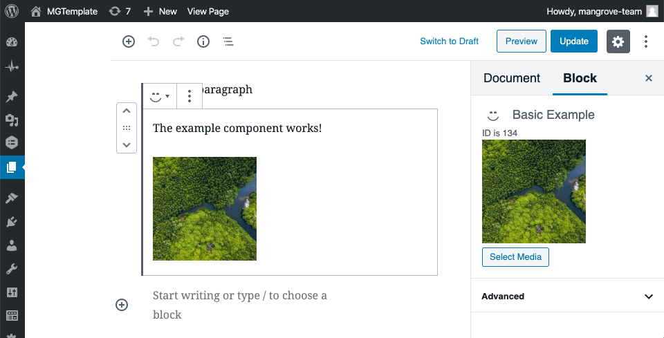
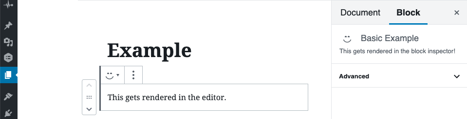
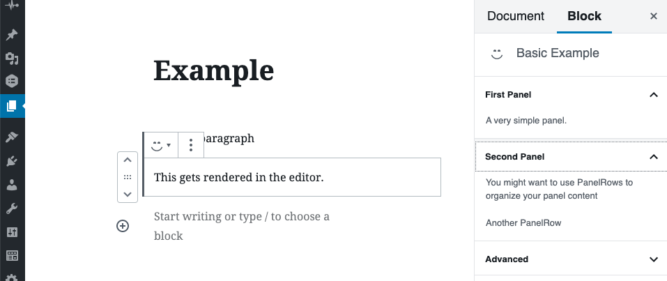

# Inspector Controls
Gutenberg edit components render right in the WP block editor.
This is great for previews and some types of content entry, but,
many times, it will be easier to add block settings in the block inspector.


*The block inspector, on the right.*

## The InspectorControls Component
To add to the block inspector, add the InspectorControls component to your block component.

```js
// src/example/index.js
import { InspectorControls } from '@wordpress/block-editor'

export default function Example( props ){
  return (
    <>
      <p>This gets rendered in the editor.</p>

      <InspectorControls>
        <p>This gets rendered in the block inspector!</p>
      </InspectorControls>
    </>
  )
}
```



## Panels
Use the `Panel` component to organize your inspector content.

```js
// src/example/index.js
import { InspectorControls } from '@wordpress/block-editor'
import { PanelBody, PanelRow } from '@wordpress/components'

export default function Example( props ){
  return (
    <>
      <p>This gets rendered in the editor.</p>

      <InspectorControls>
        <PanelBody title="First Panel">
          <p>A very simple panel.</p>
        </PanelBody>
        <PanelBody title="Second Panel" initialOpen={ false }>
          <PanelRow>
            <p>You might want to use PanelRows to organize your panel content</p>
          </PanelRow>
          <PanelRow>
            <p>Another PanelRow</p>
          </PanelRow>
        </PanelBody>
      </InspectorControls>
    </>
  )
}
```

