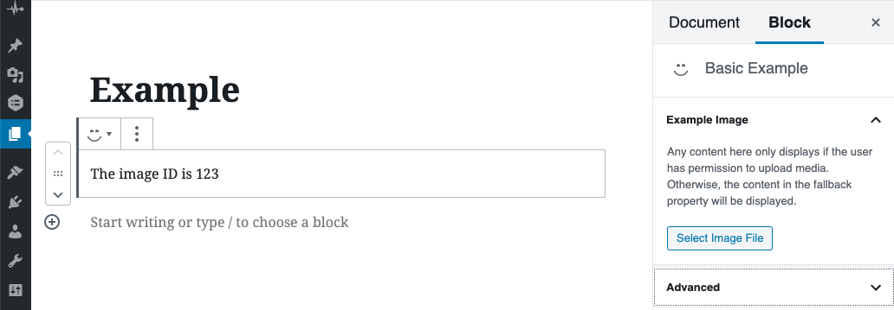

# Media
Use the `MediaUploadCheck` and `MediaUpload` components for handling attached media in custom blocks.

## Selecting Media
`MediaUploadCheck` checks whether the logged in user has permission to upload media.
If so, the component children are rendered.
Otherwise, the `fallback` is rendered.
This can be placed inside both the block component and/or within the InspectorControls.

[MediaUpload](https://github.com/WordPress/gutenberg/blob/master/packages/block-editor/src/components/media-upload/README.md) uses a `render` property instead of rendering its children.
This provides the `open` function, which opens the media library modal.
Again, you can use this anywhere in your block component -
within or outside the `InspectorControls`.
Make sure it's inside the `MediaUploadCheck` component, though.
When the media is selected, `onSelect` will be called, passing an object with all the media details.
I recommend you save just the ID of your media file as an attribute.
Also, you probably only want to allow certain types of media.
`allowedTypes` takes and array of acceptable mime types.

```jsx
// src/example/index.js
import {
  InspectorControls,
  MediaUploadCheck,
  MediaUpload,
} from '@wordpress/block-editor'
import {
  Button,
  PanelBody,
  PanelRow
} from '@wordpress/components'

export default function Example( props ){
  const {
    attributes,
    setAttributes
  } = props
  const saveImage = ({ id }) => {
    setAttributes( { image: id } )
  }
  // This was getting unwieldy, so I split the editor block and the inspector controls into
  // separate components.
  return (
    <>
      <EditorBlock {...attributes} />
      <Inspector saveImage={ saveImage } />
    </>
  )
}

function EditorBlock( { image } ){
  return(
    <p>{`The image ID is ${image}`}</p>
  )
}

function Inspector( { saveImage } ){
  const mediaFallback = <p>To edit the image, you need permission to upload media.</p>
  return (
    <InspectorControls>
      <PanelBody title="Example Image">
        <MediaUploadCheck fallback={ mediaFallback }>
          <PanelRow>
            <p>
              Any content here only displays if the user has permission to upload media.
              Otherwise, the content in the fallback property will be displayed.
            </p>
          </PanelRow>
          <PanelRow>
            <MediaUpload
              title="Title for the media library modal."
              allowedTypes={['image']}
              onSelect={ saveImage }
              render={
                ({open}) => (
                  <Button isDefault onClick={open} >Select Image File</Button>
                )
              }
            />
          </PanelRow>
        </MediaUploadCheck>
      </PanelBody>
    </InspectorControls>
  )
}
```


## Displaying Images
Since you only save the ID,
you have to fetch the rest of the image data when you render the component with `apiFetch`.

```jsx
// src/example/index.js
import { useState, useEffect } from '@wordpress/element' // Instead of importing from 'react'.
import apiFetch from '@wordpress/api-fetch'

...

function EditorBlock( { image } ){
  const [ imageData, setImageData ] = useState( null )
  useEffect(
    () => {
      // Note: this callback cannot be an async function,
      // but you can still make asynchronous calls as long as you don't use the
      // `await` keyword.
      apiFetch( { path: `/wp/v2/media/${image}`} ).then(
        data => { setImageData( data ) }
      )
    },
    [image] // Only call callback when image has changed.
  )
  return(
    imageData ?
    <figure>
      
      <figcaption>
        <p>{`The image ID is ${image}`}</p>
      </figcaption>
    </figure> :
    <p>{`The data for image ${image} is loading.`}</p>
  )
}
```
