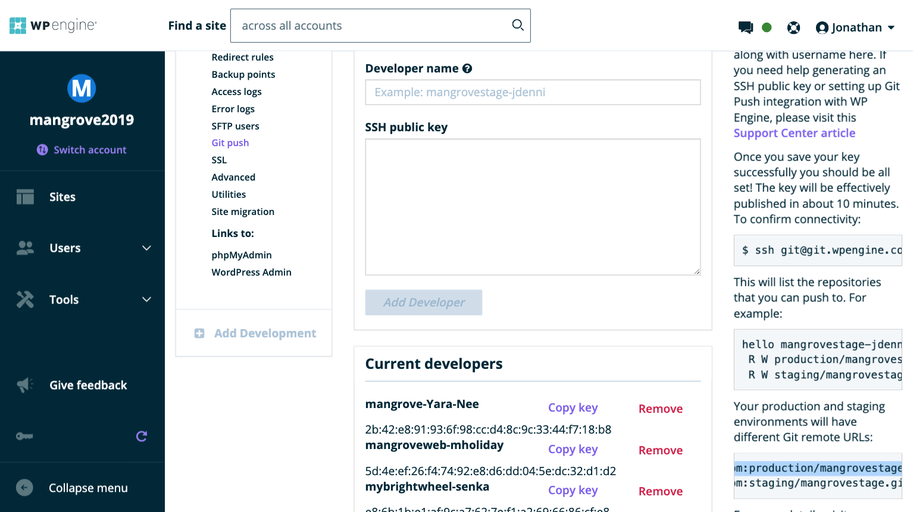
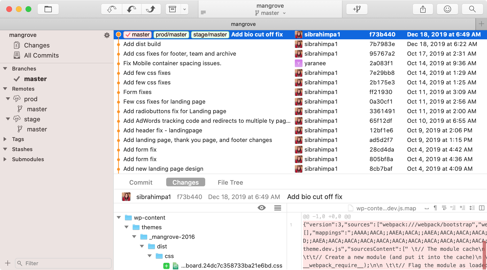

## Git
Make sure your Git Push user is already set up, as shown in the [access documentation](/access).

Now you can [add your SSH Key](/wpengine/add-git-key) to the project you are working on. Once you have added your key, it can take several minutes for access to be granted.

### Clone the Development Repository
Most projects will have both development and production environments. Start by cloning the staging or development repository.

To get the repository URL, go to [my.wpengine.com](https://my.wpengine.com/) and click the `STG` environment of your project, then "Git Push" in the left menu. In the bottom right, you fill find the Git URL for that install.

**Important note**: There are two Git URLs listed for each environment. _Always_ use the top
`git@git.wpengine.com:production/installname.git`
URL, and _never_ the
`git@git.wpengine.com:staging/installname.git`
URL, even if you are working on a staging environment. The second URL is for the [legacy staging system](/wpengine).



### Add the Production Repository
Once you have cloned a site to a local repository, rename the remote `origin` to `stage` (assuming you cloned the staging environment).

```bash
git remote rename origin stage
```

Then, add the production environment repository as an additional remote named `prod`.

(Replace `produrl` with the Git URL from the production environment.)
```bash
git remote add prod produrl
```

Now `git fetch --all` to see the latest branches on both remotes.

Your Git GUI should now show both remotes and remote branches, something like this:



Next step: [Add SFTP Config](/local-development/sftp-config)
