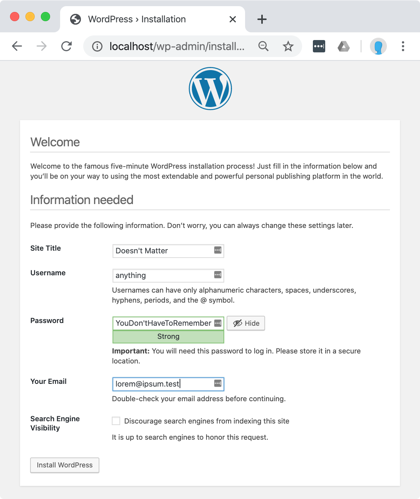

# Start WordPress

Open your terminal in the root of your git repository.

`docker-compose up -d` starts server containers in _detached_ mode so your command line stays on your host machine.

It can take some time to start up, especially on the first run. When it's ready, you will find:

Wordpress at http://localhost

## Initialize WordPress
Go through the WordPress install process on localhost. The values you enter in the install screen do not matter; they will be overwritten when you import the site data. The local database just needs to be initialized.

http://localhost

Now that WordPress is installed, you can [download the plugins and site data](sync).
