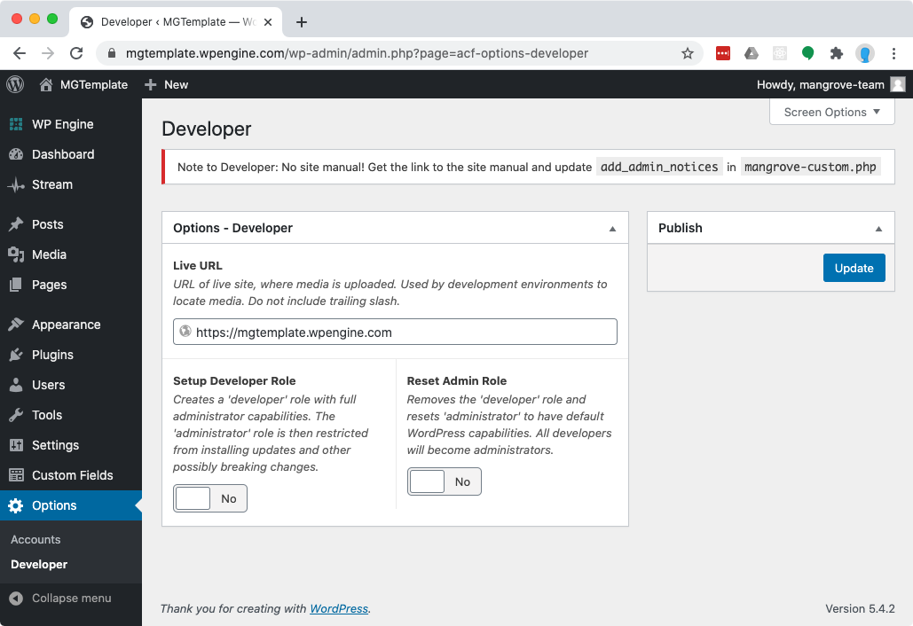

# User Roles and Capabilities
WordPress user roles and capabilities have been adjusted on MGTemplate.
On sites maintained by Mangrove,
clients should have full access to manage site content and users.
However, clients should not install plugins or updates themselves,
as this is part of the Mangrove maintenance plan.

## Custom Developer Role

A custom Developer role has been added with full capabilities,
and the mangrove-team and maiya users are assigned this role by default.
The Administrator role keeps full content capabilities,
but capabilities relating to updates and other development/maintenance have been removed.

WordPress manages roles and capabilities within the database,
so there is an Options page to setup or reset these roles.
This page is found in WP-Admin > Options > Developer,
and is only visible to users with the `update_core` capability.

## Changing Roles
When the Developer role exists,
any user with `promote_users` capability can assign the Developer role to any user.
Both Administrators and Developers have this capability.

## Older Sites
This setup is not required for most sites that do not already have it.
Older sites may have capabilities removed from the Administrator role
and specifically applied to the mangrove-team and maiya users.
To reset the Administrator role to default capabilities,
the WordPress core `populate_roles` function needs to be called once.
Please note: running `populate_roles` may conflict with plugins that adjust roles and capabilities.

If you would like to update a project with the new roles,
copy over the relevant code and then reset the admin role and setup the developer role.

## Relevant Code
All functions related to this feature are in `mangrove-custom.php`
under `/* Roles and Capabilities */`.
These are triggered by the `acf/update_value` filter.

Additionally, the relevant ACF Options page is added by the `add_acf_options_pages` function,
and the fields for this page are defined by the _Options - Developer_ field group
in the `group_5f0482efbae78.json` ACF JSON file.
If copying this feature to an existing site with one or more pre-existing ACF options pages,
carefully review the code adding those pages and the existing options fields
to ensure there are no conflicts.
All fields on all options pages are stored on the same options table,
and therefore require unique field names.

## Troubleshooting
If you are having trouble accessing screens in WP-Admin,
try resetting the roles by going to Options > Developer and Reset Admin Role,
then Setup Developer Role.
This may be necessary for WooCommerce to work properly.
Make sure to backup the site before doing this!
