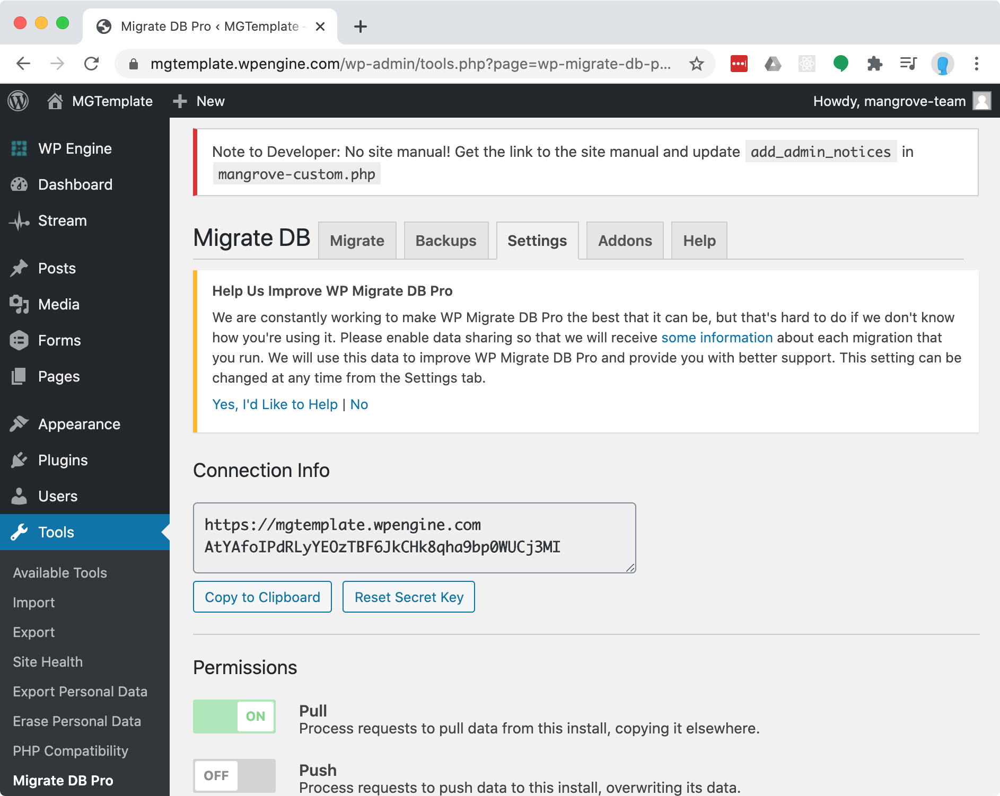
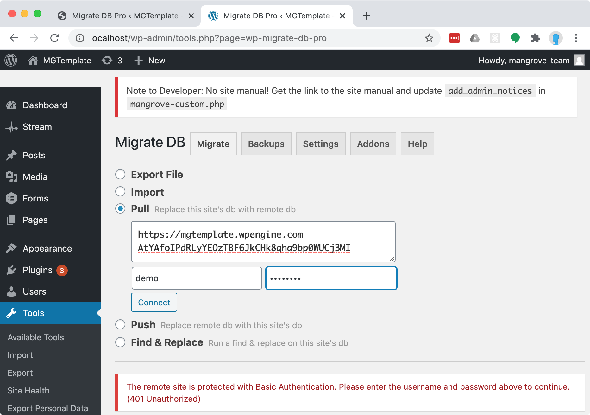
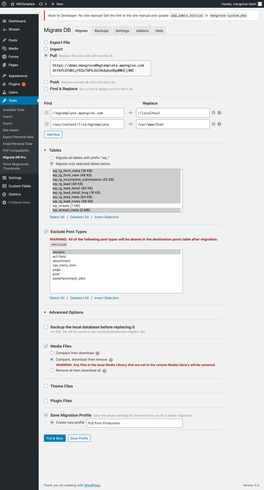

# Migrate DB Pro + Media Addon
Migrate DB Pro will copy database tables between WordPress installs
and provides search and replace functionality to correct for differences between installs.
It is included in MGTemplate and should be installed on most projects.

The Media Addon allows you to additionally download media files.

## Issues
This plugin provides one of the most convenient and universally available options to synchronize
WordPress installs, and the only one to conveniently copy over specific database tables.
However, this works as a WordPress plugin, and therefore processes everything with PHP using the
server resources available to the WordPress installs.
This is generally not a problem, but it can be much slower than other methods,
and the resource usage may affect website performance and stability while it is running.

## Setup
-  Migrate DB Pro requires a license key for full functionality and addons.
    Search for "Migrate DB Pro License Key" in LastPass for the Mangrove license key.
- Migrate DB Pro + Media Addon need to be installed on both source and destination installs.
- It's best to have all plugins on the source install also installed on the destination install,
    ideally with matching or latest versions.
    
## Pull
Generally, you will want to pull the database and files from the source to the destination.

1. Log into the source install and copy the connection info from
    _Tools > Migrate DB Pro > Settings_.
    Also make sure that "Pull" under Permissions is set to "ON".
    
2. Log into the destination install select "Pull" under
    _Tools > Migrate DB Pro > Migrate_.
3. Paste the connection info in the field provided.
    If the source site is password protected with basic authentication,
    you will also need to enter that username and password.
    
3. Select your pull settings.
    - Find and Replace should be automatically filled with necessary values.
    - You may want to exclude the `wp_stream` and `wp_itsec_*` tables as they can be large and 
        unnecessary.
    - You may want to exclude the `revisions` post type.
    - Select Media Files to sync media files. This is not necessary if you do this via SFTP.
    - Save Migration Profile with a descriptive name like "Pull from Production" so you don't have
        to enter all these settings every time.
    
4. "Pull & Save" to finish!
