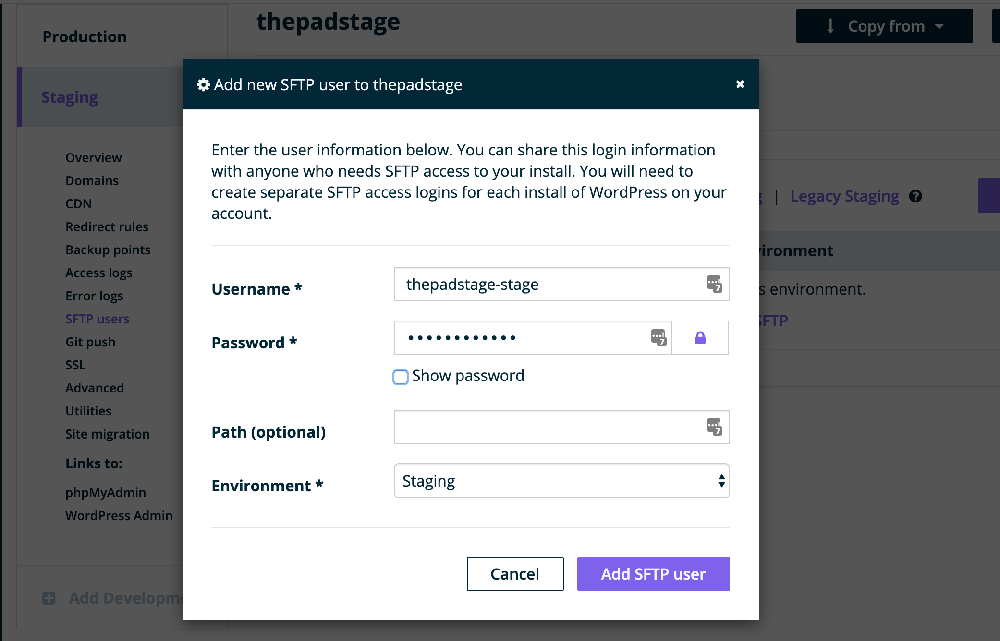
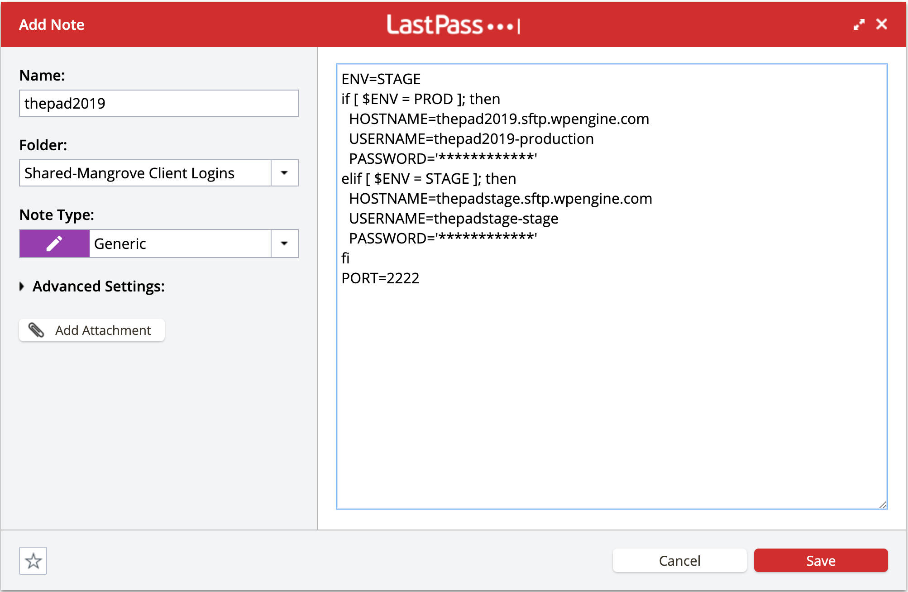

# Create an SFTP User
As you add SFTP login to the WPE install, you also need to add them to LastPass.  You will need to switch back and forth between your WPE Add SFTP Login screen and the LastPass Add Note screen, so don’t close either too early.


## Add User in WPEngine
My WPEngine > Select environment > “SFTP Logins” > “Add SFTP user”
* Username: _installname-environment_
* Password: click the lock icon to generate a secure password
* Path: leave this field blank



## Add to LastPass
* Click the LastPass icon in your browser
* Secure Notes > Add Note
* Note Type: Generic
* Folder: Shared-Mangrove Client Logins [^1]
* Name: Site Name SFTP
* Enter credentials in the note in this format:

```sh
ENV=STAGE
if [ $ENV = PROD ]; then
  HOSTNAME=
  USERNAME=
  PASSWORD=''
elif [ $ENV = STAGE ]; then
  HOSTNAME=
  USERNAME=
  PASSWORD=''
fi
PORT=2222
```



[^1]: If you don't have access to the client logins folder, you can put it in _Mangrove Team Internal (Limited) - for new devs_
