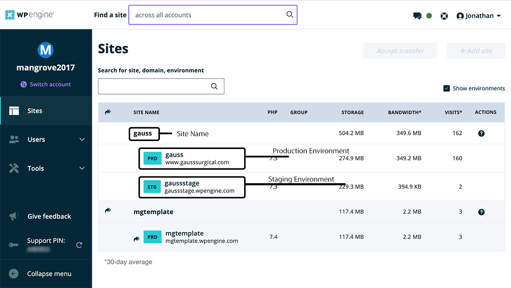

# Introduction to WPEngine
Log in to [my.wpengine.com](https://my.wpengine.com/). A Mangrove administrator should already have given you access the sites for you to work on. Sites are listed under various accounts, so if you don't see it at your my.wpengine.com home screen, you may need to use the "switch account" link.

## Environments
On WPEngine, each site has one or more environments. Each of these is a complete WordPress install with a separate database and files. The production environment (PRD) hosts the live website, while the other environment(s) is(/are) used for development.

## Legacy Staging
Before the current environments system, WPEngine had a "1-Click Staging" system. This is now a legacy system which we no longer use. Do not use the legacy staging system, but be aware that it still exists within WPEngine and be careful not to get it confused with the staging environment.

## Git Deploy
Each WordPress install on WPEngine has a corresponding Git repository.
- *Any* branch pushed to this repository gets deployed to that install, so we generally only push the `master` branch.
- The first branch pushed to a WPE Git repository can never be removed, so if you are initializing a new install, _make sure to push the `master` branch first_.
