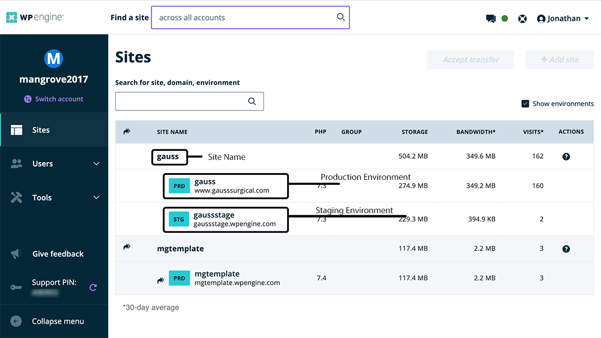

# Introduction to WPEngine

WPEngine is organized by Accounts, Sites, and Environments.

Log in to [my.wpengine.com](https://my.wpengine.com/).
A Mangrove administrator should already have given you access the sites for you to work on.

## Accounts
Mangrove currently (Aug. 2020) has two WPEngine accounts: Mangrove2017 and Mangrove2019.
Additionally, clients may have their own accounts which we have access to.
Use the "Switch Account" link to see all the accounts you have access to.

## Sites and Environments
On WPEngine, each _site_ has up to three _environments_.
Each environment includes a complete WordPress install and accompanying tools and settings.
The production environment (PRD) hosts the live website,
while the other environments is used for staging and development.

## Legacy Staging
Before the current environments system, WPEngine had a "1-Click Staging" system. This is now a legacy system which we no longer use. Do not use the legacy staging system, but be aware that it still exists within WPEngine and be careful not to get it confused with the staging environment.

## Git Deploy
Each environment has a Git repository.
- *Any* branch pushed to this repository gets deployed to that install,
    so we generally only push the `master` branch.
- The first branch pushed to a WPE Git repository can never be removed,
    so if you are initializing a new install, _make sure to push the `master` branch first_.

Next step: [Local Development](/local-development)
