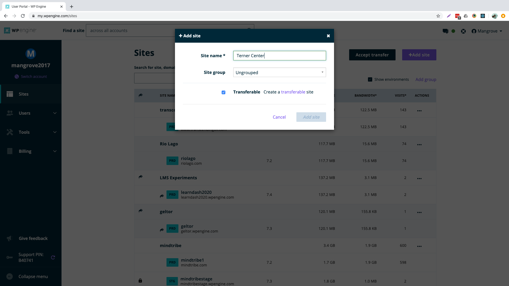
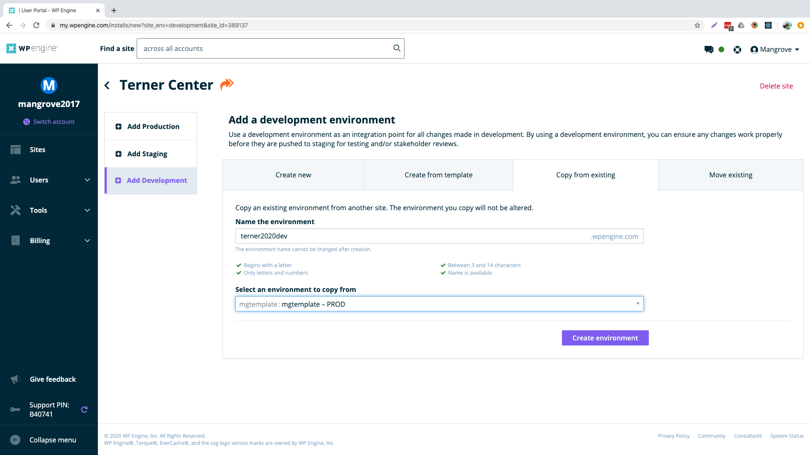
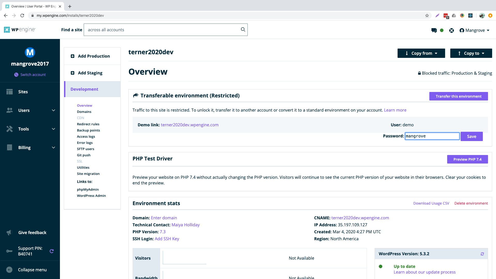
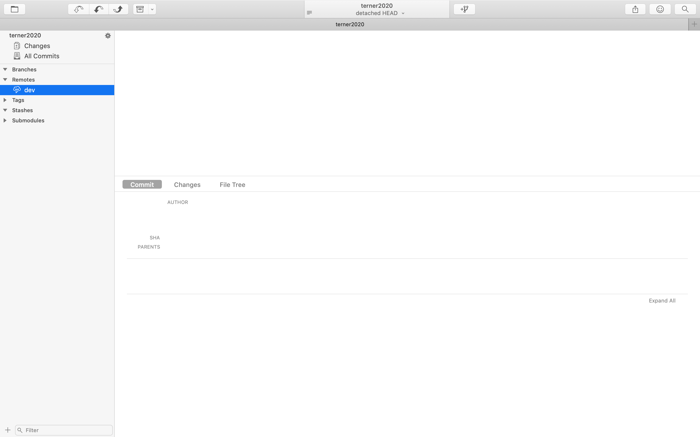
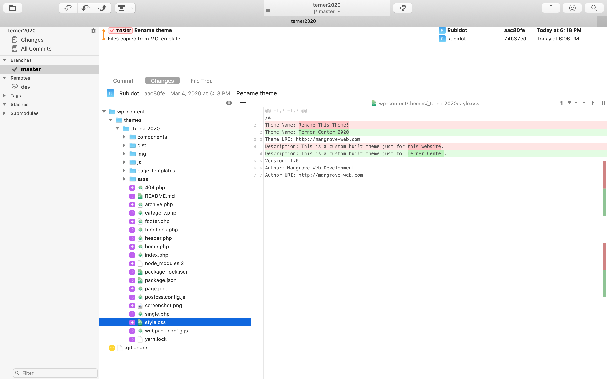
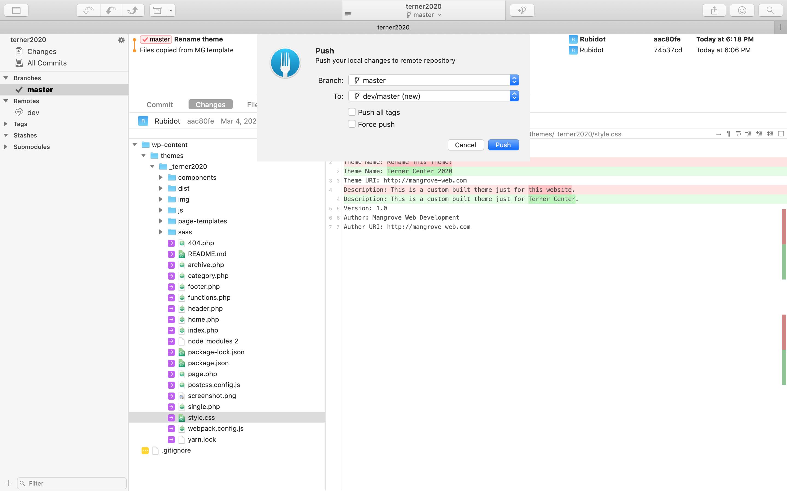
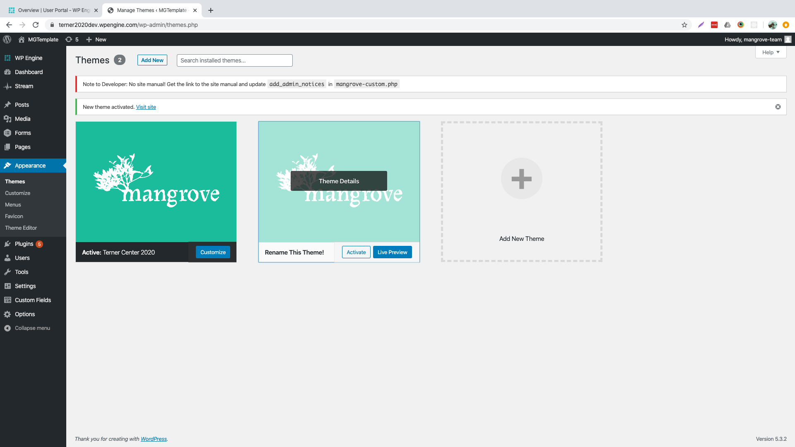

# Creating a New WPEngine Install
You will need billing or owner account access to do this.
As of March 2020, new sites should be created on the `mangrove2017` WPEngine account. This will change in the future when we are closer to account limits.

To begin, create a copy of the
[Asana WP Setup Checklist](https://app.asana.com/0/49479446717542/16235914790820)
and rename/reassign the copy to your project. 

## Add Site
* Log into the WPEngine Dashboard, make sure you're looking at the `mangrove2017` account, and click "Add Site" in the top right corner.
* The **Site Name**, not to be confused with an _install name_, can be changed later, and only needs to be unique on this account.
* Check **Transferrable**, unless you're positive we won't want to move this site to a client-owned or other Mangrove account by launch time.

## Add Development Environment
The site will need to be developed first, so start with the Development environment.

* Select **Add Development**.
* Select **Copy from existing**
* Name the environment _sitenameyeardev_.
* Copy from `mgtemplate - PROD`

## Set The Demo Password
Once the Development Environment is finished building, you will be able to change password that protects the front-end from being publicly available. Change this to `mangrove`.

## Setup Git Repo
### Clone the Development Environment
* Add yourself for Git push access.
* Clone the development environment repository (after the environment has finished being built and your Git push access has taken effect).
* The cloned repo will be empty with no branches locally or on the remote `origin`.
* Rename the remote `origin` to `dev` (since you cloned the development environment).

### Add The Starter Files
Copy and commit these files/folders from MGTemplate:

* docker-compose
    * **Important!** Make sure you don't commit `docker-compose/sftp-config`
* wp-content/themes/\_mgstarter
* wp-content/plugins/mangrove-custom
* .dockerignore
* .editorconfig
* .gitattributes
* .gitignore
* docker-compose.yml
* Dockerfile
* README-Docker.md
* README.md

### Rename and Edit Files
* Remove the data from `docker/sftp-config` so you don't accidentally connect to MGTemplate.
* Rename Theme
    * Rename \_mgstarter folder to `_projectnameYear`. [^1]
    * Update information in style.css
    * Update line 13 in .gitignore from  
    `!/wp-content/themes/_mgstarter` to  
    `!/wp-content/themes/_yourthemename`
    * Update line 39 in docker-compose.yml from  
    `- ./wp-content/themes/_mgstarter/:/theme` to  
    `- ./wp-content/themes/_yourthemename/:/theme`
* Update `docker-compose/sftp-config` with the correct credentials.

[^1]: The `_` in the theme name keeps it first in the list of installed themes.

### Push Master to Dev
Push branch `master` to the remote `dev`. This will deploy the branch to WPEngine.

## Activate the New Theme
Once your changes have deployed:
* Log into WP-Admin with the same username and password as MGTemplate.
* Activate the new theme.
* Delete any other themes installed in WordPress, including the template theme (called _Rename This Theme!_) if it is still there.

## Add To LastPass
While still logged in to WP-Admin:
* Create a new password for user _mangrove-team_.
* In your browser toolbar, click the LastPass icon > Sites > Add Site.
* **URL:** Install domain name. Remove anything after the `/`.
* **Name:** _Site Name_ Dev WP-Admin
* **Folder:** Shared-Mangrove Client Logins
* **Username:** mangrove-team
* **Password:** The new password you just created.

## Sync Down To Local
The install on WPEngine is all set, so now you can [add an SFTP user](add-sftp-user) and [finish setting up your local dev](/local-development/sftp-config).
